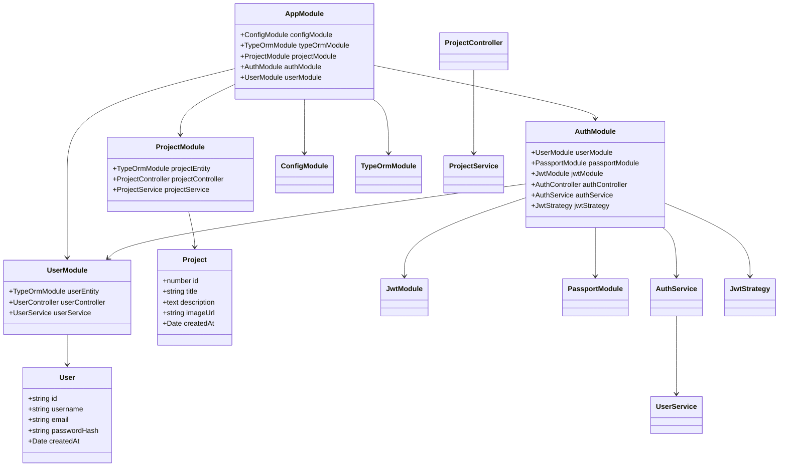

# Mermaid Class Diagram for housedesign

```mermaid
classDiagram
    class AppModule {
        +ConfigModule configModule
        +TypeOrmModule typeOrmModule
        +ProjectModule projectModule
        +AuthModule authModule
        +UserModule userModule
    }

    class AuthModule {
        +UserModule userModule
        +PassportModule passportModule
        +JwtModule jwtModule
        +AuthController authController
        +AuthService authService
        +JwtStrategy jwtStrategy
    }

    class UserModule {
        +TypeOrmModule userEntity
        +UserController userController
        +UserService userService
    }

    class ProjectModule {
        +TypeOrmModule projectEntity
        +ProjectController projectController
        +ProjectService projectService
    }

    class User {
        +string id
        +string username
        +string email
        +string passwordHash
        +Date createdAt
    }

    class Project {
        +number id
        +string title
        +text description
        +string imageUrl
        +Date createdAt
    }

    AppModule --> ConfigModule
    AppModule --> TypeOrmModule
    AppModule --> ProjectModule
    AppModule --> AuthModule
    AppModule --> UserModule

    AuthModule --> UserModule
    AuthModule --> JwtModule
    AuthModule --> PassportModule
    AuthModule --> AuthService
    AuthModule --> JwtStrategy

    UserModule --> User
    ProjectModule --> Project
    ProjectController --> ProjectService
    AuthService --> UserService
```